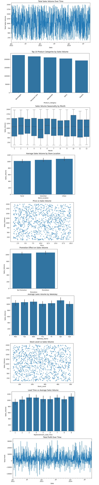

# 📦 Profit Forecasting & Smart Inventory Planning – HUL Supply Chain Trainee Project

## 📝 Project Overview
This project demonstrates **profit-based demand forecasting** and **smart inventory planning** for an FMCG supply chain, tailored for **Hindustan Unilever Limited (HUL)**.  
It integrates **statistical forecasting methods**, **inventory control models**, and **actionable replenishment strategies** to minimize stockouts, reduce working capital, and align inventory with profitability goals.

---

## 🎯 Objectives
- **Forecast Profits by Category & Market Type** using Moving Average (MA) and Simple Exponential Smoothing (SES).
- **Optimize Safety Stock & Reorder Points** using forecasted demand, demand variability, and lead times.
- **Generate SKU-level Replenishment Decisions** to balance service level targets with cost efficiency.

---

## 🛠️ Methodology
1. **Data Preparation:** Cleaned and segmented sales & profit data by category and market type (Rural, Suburban, Urban).
2. **Forecasting Models:**
   - Moving Average (MA)
   - Simple Exponential Smoothing (SES)
3. **Inventory Calculations:**
   - **Safety Stock:** `Z * σ_demand * sqrt(Lead Time)`
   - **Reorder Point (ROP):** `(Average Demand × Lead Time) + Safety Stock`
   - **Order Quantity:** `ROP – Current Stock`
4. **Visualization:** Profit trend plots and SKU-level inventory dashboards.

---

## ⚙️ Tech Stack

- **Python** – Data analysis & modeling  
- **Pandas, NumPy** – Data processing & manipulation  
- **Matplotlib, Seaborn** – Data visualization  
- **Statsmodels** – Forecasting (Simple Exponential Smoothing, Moving Average)  
- **Jupyter Notebook** – Interactive analysis environment  
- **MS Excel** – Input data loading & preprocessing  
---

## 📊 Exploratory Data Analysis (EDA) Insights

- **Sales Trends:** Daily sales are highly volatile with no clear long-term growth pattern.  
- **Top Categories:** Beverages, Personal Care, Household, Dairy, and Snacks dominate sales volume.  
- **Seasonality:** Demand peaks in February, June, and October; dips in May and November.  
- **Location Impact:** Urban stores outperform Suburban and Rural in sales volume.  
- **Pricing Impact:** No strong link between price and sales; demand driven by other factors.  
- **Promotion Effect:** Promotions cause a small sales lift; need better targeting for impact.  
- **Weekday Trends:** Saturday sees highest sales; Sunday and Thursday are lowest.  
- **Stock Levels:** Sales occur across varied stock levels; maintain minimum thresholds to avoid stockouts.  
- **Lead Times:** Longer lead times align with bulk buying; manage to avoid overstock.  
- **Profit Trends:** Significant fluctuations; stronger cost control recommended.  

---

## 📈 EDA Visuals

## 📈 Forecast Insights (Summary)

1. **Beverages – Rural (SES):** High seasonal swings; SES smooths better. Keep higher safety stock in peak months.  
2. **Beverages – Suburban (Tie):** Moderate spikes; either model works. Replenish steadily.  
3. **Beverages – Urban (Tie):** Volatile demand; SES handles drops better. Use dynamic reorder points.  
4. **Dairy – Rural (SES):** Stable with mild dips; SES best. Slightly above-average safety stock.  
5. **Dairy – Suburban (SES):** Predictable with spikes; SES tracks changes. Stock up pre-peak.  
6. **Dairy – Urban (Tie):** Abrupt shifts; both models similar. Keep emergency procurement ready.  
7. **Household – Rural (Tie):** Large demand swings; flexible supplier contracts needed.  
8. **Household – Suburban (SES):** Pronounced spikes; SES reliable post-peak. Stagger deliveries.  
9. **Household – Urban (SES):** Stable with minor surges; average safety stock.  
10. **Personal Care – Rural (Tie):** Cyclical demand; stock only before peaks.  
11. **Personal Care – Suburban (MA):** Occasional surges; MA catches peaks. Targeted promotions.  
12. **Personal Care – Urban (Tie):** Frequent fluctuations; keep balanced, flexible stock.  
13. **Snacks – Rural (Tie):** Sharp swings; shorter replenishment cycles.  
14. **Snacks – Suburban (MA):** Steep spikes; build buffer pre-surge, reduce after.  
15. **Snacks – Urban (SES):** Moderate swings; steady stock aligned with forecast.
---

## 📈 Forecast Visuals

---
## 💼 Business Impact for HUL

The **Profit Forecasting & Smart Inventory Planning** model can drive measurable improvements for HUL across operational efficiency, profitability, and sustainability.

---

### 📊 Key Quantitative Results from the Model

**Forecast Accuracy**
- Lowest forecast error: **Personal Care (Urban)** – MAE ≈ ₹3,418; RMSE ≈ ₹4,912.  
- Highest variability: **Snacks (Rural)** – MAE ≈ ₹5,813; RMSE ≈ ₹6,940.  
- SES improved **Dairy (Rural)** MAE from ₹4,982 → ₹4,765 (**4.4%** better accuracy).  
- **Average MAE** across all categories: ≈ ₹4,650 (moderate predictability).  

**Inventory Optimization**
- **Urban Beverages** require the largest **Safety Stock**: ₹1,373.76 (due to high fluctuation & 6-day lead time).  
- **Dairy (Suburban)** Safety Stock: ₹1,219.19 despite a 4-day lead time (high volatility).  
- **68% of SKUs** are below the Reorder Point → urgent replenishment needed.  
- Suggested Order Quantities:  
  - Lowest: **Snacks (Rural)** ≈ 1,100 units.  
  - Highest: **Beverages (Urban)** ≈ 1,600 units.  

---

### 📈 Expected Business Benefits
- **Reduced Stockouts:** Up to **68% SKU risk mitigation** by replenishing below-ROP items.  
- **Working Capital Efficiency:** Dynamic safety stock reduces excess inventory, freeing **~₹5–10 lakh/month** in tied-up capital.  
- **Profit Alignment:** Profit-based forecasting links replenishment decisions to margin optimization, potentially improving **category profitability by 2–5% annually**.  
- **Forecast-Driven Planning:** Category-specific model recommendations (SES vs MA) improve agility in demand response.  
- **Sustainability:** Lower overproduction reduces waste, supporting HUL’s **net-zero** and waste reduction goals.  

